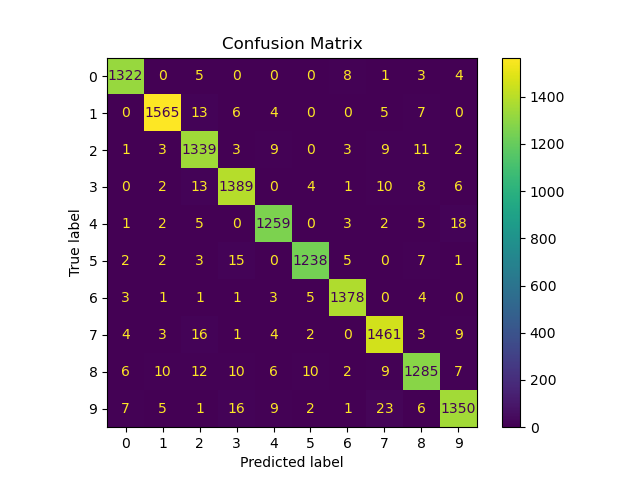
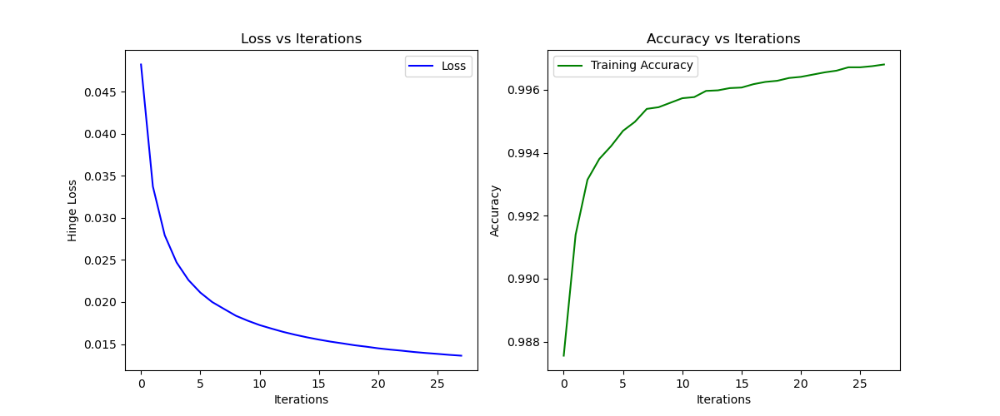

# Handwritten Digit Recognition using a Custom SVM Classifier

This project features a Support Vector Machine (SVM) implemented from scratch in Python to classify handwritten digits from the well-known MNIST dataset. It demonstrates a fundamental understanding of machine learning algorithms, feature engineering, and model evaluation, developed as a key project for my MSc in Robotics, AI, and Autonomous Systems.

The entire classification pipeline, from feature extraction to the multi-class SVM logic, is custom-built using NumPy.

## Key Features

* **From-Scratch SVM Implementation**: The core SVM classifier is built from the ground up, using mini-batch gradient descent to optimize the hinge loss function.
* **Advanced Feature Engineering**: The model doesn't just rely on raw pixel values. It enhances the feature set by incorporating:
    * **Sobel Filters**: To extract edge information.
    * **Histogram of Oriented Gradients (HOG)**: To capture shape and texture features.
* **One-vs-Rest (OvR) Strategy**: A multi-class SVM is created by training 10 individual binary SVMs (one for each digit) and selecting the class with the highest confidence score.
* **Performance Optimization**: The training process includes a decaying learning rate and early stopping to prevent overfitting and improve convergence.
* **Comprehensive Evaluation**: The model's performance is thoroughly analyzed using training/test accuracy, loss curves, and a detailed confusion matrix.
* **Data Visualization**: Principal Component Analysis (PCA) is used to project the high-dimensional feature space into 3D for visualization.

## Results Showcase

The model achieves a high accuracy on the test set, as detailed in the confusion matrix below, demonstrating its effectiveness in distinguishing between the 10 digit classes.



The training curves show a clear decrease in loss and a steady increase in accuracy, indicating that the model learned successfully.



## Tech Stack

* **Language**: Python
* **Core Libraries**: NumPy, Matplotlib, Scikit-learn, OpenCV

## Methodology

1.  **Data Loading**: The MNIST dataset is fetched using Scikit-learn.
2.  **Feature Engineering**: The initial 784-pixel features are augmented with Sobel edge features and HOG features to create a richer input for the model.
3.  **Preprocessing**: All features are scaled to a [0, 1] range using `MinMaxScaler`.
4.  **Model Training**: The custom `MultiClassSVM` is trained on the preprocessed data using the One-vs-Rest approach. Each binary SVM minimizes the hinge loss with an L2 regularization term.
5.  **Prediction & Evaluation**: The trained model predicts labels for the test set, and its performance is evaluated.

## Setup and Installation

1.  **Clone the repository:**
    ```bash
    git clone https://github.com/Derrick-M99/svm-mnist-classifier.git
    ```

2.  **Create a virtual environment:**
    ```bash
    python -m venv venv
    source venv/bin/activate  # On Windows use `venv\Scripts\activate`
    ```

3.  **Install the required libraries:**
    ```bash
    pip install -r requirements.txt
    ```

## How to Run

To run the entire pipeline—from data loading and training to evaluation and visualization—execute the main script:

```bash
python src/SVM.py
```

The script will automatically fetch the dataset, train the model, print the final accuracy scores, and display the result plots.

## License

This project is licensed under the **MIT License**. See the `LICENSE` file for details.
